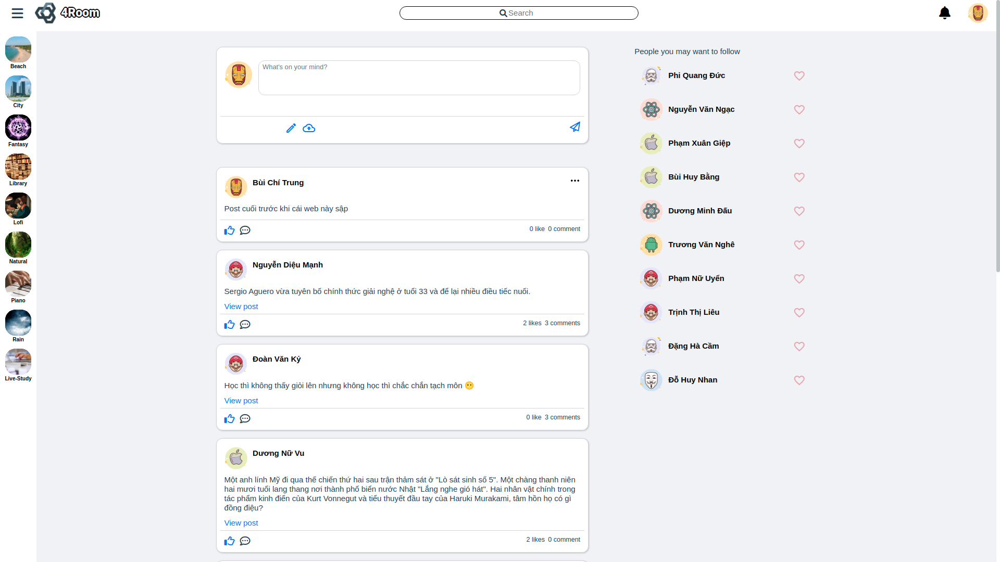
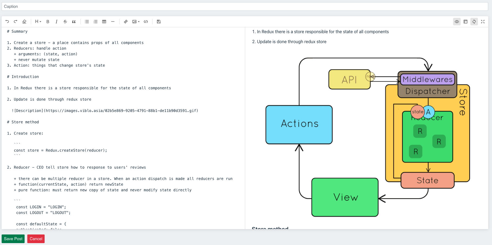
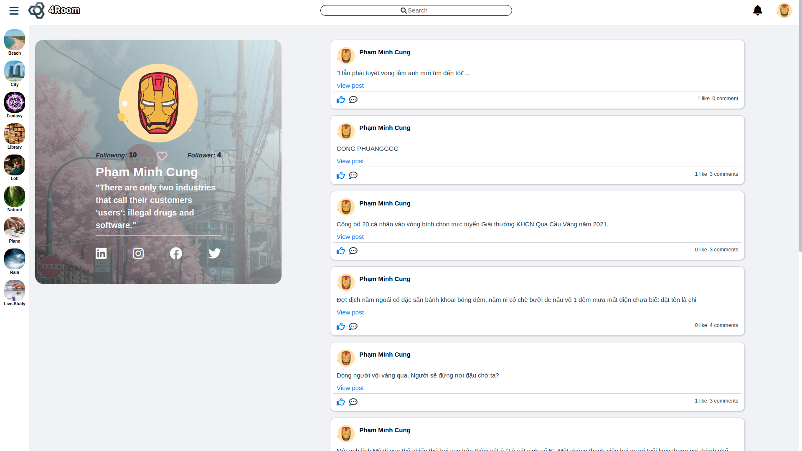
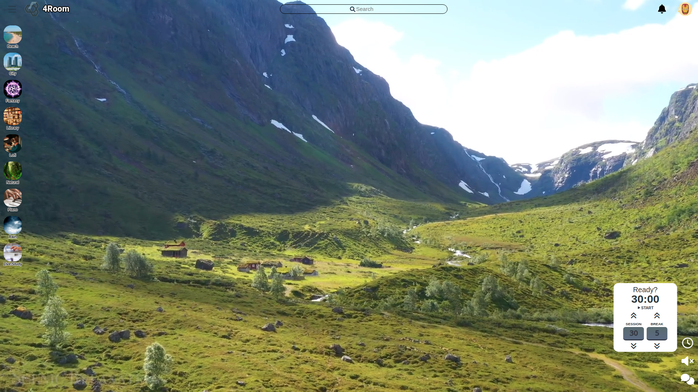
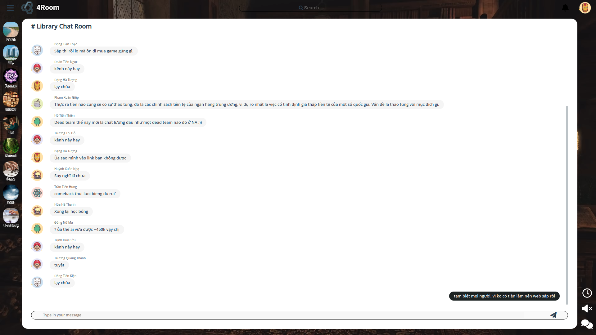

# 4Room
+ Front-end: https://github.com/BuiChiTrung/4Room-FE
+ Back-end: https://github.com/superkink3124/4Room-BE
+ Docker: https://github.com/BuiChiTrung/4Room-Docker

## Project setup - with Docker

### Clone the BE, Docker repo run docker-compose, then
```
docker exec -it 4room-docker-fe-1 sh -c "cp -Tr dist volume"
```
## Project setup - without Docker
```
npm install
```

### Compiles and hot-reloads for development
```
npm run serve
```

### Compiles and minifies for production
```
npm run build
```


## Demo
### Home


### Markdown editor


### Profile


### Room, pomodoro clock


### Realtime chat
